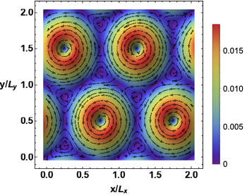
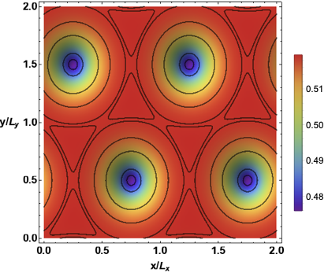
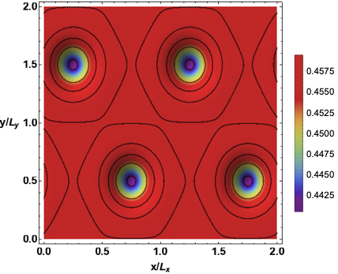
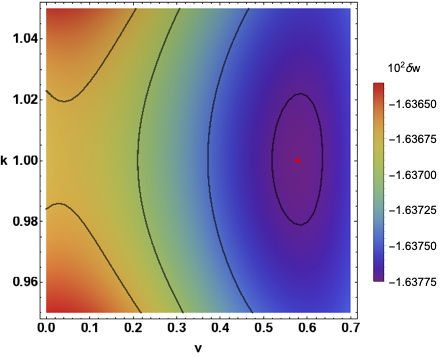

# Holographic Abrikosov Lattices

Welcome to the repository for the code used to generate the data as presented in ["Holographic Abrikosov Lattices"](https://arxiv.org/abs/2001.11510) by A. Donos, J. Gauntlett and C. Pantelidou. The purpose was to construct the holographic duals of thermal field theorie states corresponding to superfluids subject to external magnetic fields.

These are field theory configurations which are parametrised by the shape of the unit cell of the vortical lattice. Our results prove that triangular vortex lattices are thermodynamically preferred. This is a significant result since our holographic approach is valid away from the critical temperature $T_c$ of the superlfuid phase formation.

The technical task involved the solution of Einstein's non-linear equations of motion coupled to a Maxwell field and a complex scalar. Due to the formation of a vortical lattice of electric currents, the resulting elliptical problem is three dimenional. This is a significant step up  compared to the project ["Holographic Lattice Conductivity"](https://github.com/donaristos/Holographic_Lattice_Conductivity.git) which is in two dimensions.

The code utilizes the Message Passing Iterface (MPI) along with OpenMP so that it can be used on larger clusters with a distributed memory architecture. In combination with the [PETSc](https://petsc.org/release/) library, I was able to use Durham University's ["Hamilton"](https://www.dur.ac.uk/arc/hamilton/) supercomputer.

The Black Brane Solutions
---
The four dimensional black branes solutions can be generated by using the program in the folder ["Background"](Background/main.cpp). The only symmetry that the resulting spacetime has is time translations, reflecting the fact that we consider configurations in dynamical equilibrium.

The figure shows the vortical currents, the charge density and the energy density of vortices. These functions are extracted using the holographic dictionary from the full four dimensional black brane spacetime.

Thermodynamics
---
The program in the folder ["Thermo"](Thermo/main.cpp) can be used to construct multiple background solutions. For our purposes we held the temperature, chemical potential and external magnetic field fixed while varying the shape parameters of the lattice.

The figure shows a density plot of the fixed energy of the system as a function of the period $k$ and the angle parametrising the lattice unit cell. The red dot shows the configuration of minimum free energy which is an equilateral triangle. The temparature $T$ for this plot satisfies $T/T_c=1/2$.

Libraries
---
The code is in C++ and it requires the libraries:
1) [Eigen](https://eigen.tuxfamily.org/index.php?title%253DMain_Page)

   Mostly used to store and manipulate the Hessian operator in Newton's method implementation. Also used its linear solvers for the flavour of the code that uses high precision numerics.

2) [PETSc](https://petsc.org/release/)

   Used the functionality of PARDISO_64 to find the inverse of the Hessian in Newton's method when using 64-bit floats. Especially powerfull when the Hessian is sparse (e.g. finite differences).

3) [Mpreal](https://github.com/advanpix/mpreal)

   Multiple precision arithetic library used to perform computations at arbitrary numerical precision.

4) [Boost](https://www.boost.org/)

   Used for higher precision numerics.

5) [OpenMPI](https://www.open-mpi.org/)

    I opted for the OpenMPI implementation. This is the library I used to pass messages between the different nodes of the cluster. 

To compile the project, I have included a makefile to be used with Intel's C++ compiler. You might have to modify that depending on where your libraries are located and the distribution of C++ you are using. As you can see from the makefile, PETSc uses its own linker. You still need to have an MPI distribution installed and have PETSc's linker configured accordingly.

What and Where
---
The folder structure of the repository is:

 * *Mathematica*

   Contains the Mathematica notebooks I used to write the equations of motion of Einstein-Maxwell-Scalar including the DeTurck trick term in Einstein's equations. The subfolder "Background" contains the notebooks concerning the background geometries. 
   
   In case you find it useful, I have included the notebooks Thermodynamics and CNotebook. These are used to manipulate the data and extract boundary theory quantities for the backgrounds and the conductivity perturbation respectively. Moreoever, they are used to generate the differentiation matrices for both finite differences as well as spectral methods.

 * *Sourcefiles*

   The above mentioned notebooks output the equations of motion and boundary conditions in C files. These need to moved to the folder "Sourcefiles" when compiling.

* *Background*

  The program that constructs the gravitational backgrounds which are dual to the Abrikosov lattice on the conformal boundary field theory.

* *Thermo*

   The program that generates multiple solutions in order to study the thermodynamic properties of different unit cell configurations.
